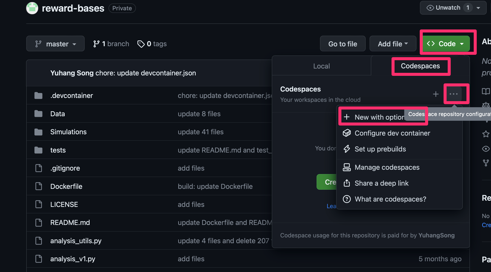
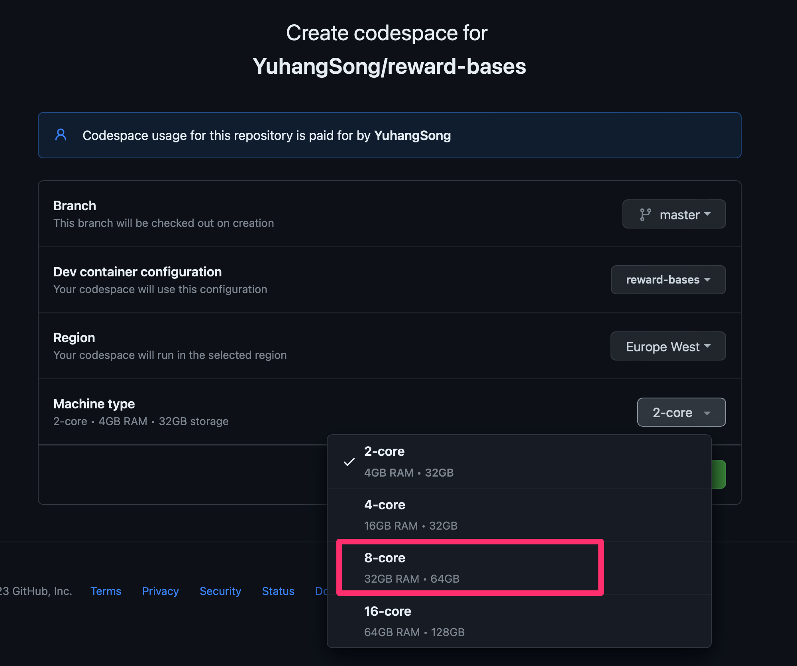

<!-- vscode-markdown-toc -->

-   1. [Setting up environment](#Settingupenvironment)
    -   1.1. [Few-clik-ready setup](#Few-clik-readysetup)
    -   1.2. [Manual setup](#Manualsetup)
        -   1.2.1. [Install dependencies](#Installdependencies)
        -   1.2.2. [Set up environment variables](#Setupenvironmentvariables)
-   2. [Structure of the code](#Structureofthecode)

<!-- vscode-markdown-toc-config
	numbering=true
	autoSave=true
	/vscode-markdown-toc-config -->
<!-- /vscode-markdown-toc -->

# Reward-Bases: Dopaminergic Mechanisms for Adaptive Acquisition of Multiple Reward Types

This repository contains the data and code for the paper [Reward-Bases: Dopaminergic Mechanisms for Adaptive Acquisition of Multiple Reward Types](https://www.biorxiv.org/content/10.1101/2023.05.09.540067v1).
By _Beren Millidge_, _Yuhang Song\*_, _Armin Lak_, _Mark E. Walton_, _Rafal Bogacz\*_.
**doi**: https://doi.org/10.1101/2023.05.09.540067. UNDER REVIEW at _Nature Communications_.

Experimental data and usage instructions with activity of primate dopamine neurons is in [Data](Data).

## 1. <a name='Settingupenvironment'></a>Setting up environment

<!-- ### 1.1. <a name='Withdocker'></a>With docker

A [`Dockerfile`](./Dockerfile) is available in the main directory above, and a pre-built docker image from this `Dockerfile` is available on docker hub here: [dryuhangsong/general-energy-nets:1.0](https://hub.docker.com/r/dryuhangsong/general-energy-nets).

For those who are not familiar with docker, it provides a image of a light-weighted virtual machine, which is widedly used as a frozen version of a environment ready for running the code with all dependencies installed.
Our code is run and tested on major Linux distributions and Darwin/Mac systems, but not on Windows, in case users are on platforms that we haven't tested our code, such as Windows, and having difficulty setting up environment, one can use the docker image which will start a virtual machine with frozen environment ready to run our code.
If you are not familar with docker but want to learn and use docker, [get started with docker](https://docs.docker.com/get-started/).

Alternatively, you can set up the environment by yourself (without docker), see [Without docker](#without-docker).

This section setup the environment without docker.

Note that exact reproducibility is not guaranteed without docker.
But you should not get obvious divergent results from what is reported in the paper, becase the code run on pretty high-level APIs of the packages, and the high-level APIs are supposed to be stable across different versions of the packages.
If you do obverve divergent results, please try to install package with version matching the docker image, and also **let us know** so that we can make a note for other users.

Also in this guide, we don't fix the package versions or python versions, because different python versions and packages versions might be supported and not supported on different systems. -->

<!-- You can use [conda](https://conda.io/projects/conda/en/latest/user-guide/getting-started.html#managing-python) or other tools to manage the python environment. -->

<!-- You then need to walk through the following a few steps to get your environment ready. -->

### 1.1. <a name='Few-clik-readysetup'></a>Few-clik-ready setup

The repo is setup with dev container so can be run directly in a github codespace, without any additional setup.

To go with this way:



You need at least this tier:



<!--  -->

If you do not see this tier, you might need a add payment info to your account.

Note the the codespace is not free, but you can get a free trial for 14 days.

Note that you can open codespace on your local vscode, or on the web (as the above).

Alternatively, you can open this repo locally on your vscode, the repo contains dev container configuration, vscode should prompt you to open the repo in a dev container, and you can click yes to open it in a dev container.

All above ways does not require you to install anything, and you can run the code directly within to dev container.

If you have to go with the manual setup, see below.

### 1.2. <a name='Manualsetup'></a>Manual setup

#### 1.2.1. <a name='Installdependencies'></a>Install dependencies

You need to install the following python packages:

```bash
pip install ray[all] torch torchvision torchaudio seaborn tqdm visdom tabulate statsmodels h5py
```

#### 1.2.2. <a name='Setupenvironmentvariables'></a>Set up environment variables

You need to set up the following environment variables:

<!-- - `DATA_DIR`: The directory where you want to store the datasets. -->

-   `RESULTS_DIR`: The directory where you want to store the results.
-   `RB_CODE_DIR`: The directory where you clone and store the code.

<!-- Of course, make sure that the directories exist.
Exactly how to set up environment variables depends on your system (a quick search on internet should give you the answer). -->

<!-- #### Download the datasets

```bash
python -c "from torchvision import datasets; import os; [eval(f'datasets.{dataset}')(os.environ.get('DATA_DIR'),download=True) for dataset in ['MNIST']]"
python -c "from torchvision import datasets; import os; [eval(f'datasets.{dataset}')(os.environ.get('DATA_DIR'),download=True) for dataset in ['FashionMNIST']]"
python -c "from torchvision import datasets; import os; [eval(f'datasets.{dataset}')(os.environ.get('DATA_DIR'),download=True) for dataset in ['CIFAR10']]"
``` -->

## 2. <a name='Structureofthecode'></a>Structure of the code

The code is organized as follows:

-   files in `./` are the main files for running the code. Following gives a brief description of each file.
    -   `main.py`: Calling this file with configuration yaml file will will launch Simulations (the backbone of the code is ray, which will launch multiple processes to run the code in parallel)
    -   `utils.py`: Utility functions
    -   `analysis_v1.py`: Functions for analyzing the results. Calling this file with configuration file will load the results and plot the figures.
    -   `analysis_utils.py`: Utility functions for analysis.
        <!-- - `*_trainable.py`: Various trainable classes that is shared across different Simulations. -->
        <!-- - `data_utils.py`: Utility functions for dataset. -->
    -   `fit_data.py`: Functions for fitting data from biological Simulations.
-   `Simulations`: This folder contains all the Simulations. Specifically, each subfolder contains
    -   the `README.md` file that describes the experiment, document the comments to run to reproduce the experiment and reproduce the figure in the paper.
    -   the configuration file(s) (`.yaml`) for the experiment.
    -   `.py` files that are specific to the experiment.
    -   `.png` and `.pdf` files that are the figures generated by the experiment.
-   `Tests`: This folder contains unit test for all layers of the code. They are coded in pytest style.

Then simply look into each subfolders in `Simulations` and follow the instructions in the `README.md` file, where the resulting figures are also documented.

By reading each `README.md` file in a markdown editor (such as viewing it on github), the resulting figures are attached inline, so it is obvious which corresponding figure it produces in the paper.

Before looking at each experiment folder, we explain the shared underlying logic of the code.
In each experiment folder, the `README.md` documents two kinds of commands to run:

-   `python main.py -c <config_file.yaml>`: This command will launch the experiment. The experiment will be launched in parallel with multiple processes (with ray as backend), and the results will be saved to `$RESULTS_DIR` in your environment variable.
    <!-- -   You will see command `ray job submit --runtime-env runtime_envs/runtime_env_without_ip.yaml --address $pssr -- ` before `python main.py -c <config_file.yaml>`, it is to submit the job to ray cluster to run instead of run locally.
        -   If you want to run locally, you can simply remove this command, and run `python main.py -c <config_file.yaml>` on your local machine.
        -   If you want to run on a ray cluster, you will need to get yourself educated about [ray cluster](https://docs.ray.io/en/latest/cluster/getting-started.html). Then you need to set up a ray cluster and set the environment variable `$pssr` to the address of the ray cluster. -->
-   `python analysis_v1.py -c <config_file.yaml>`: This command will load the results from `$RESULTS_DIR` and plot the figures. The figures will be saved to the experiment folder.
    <!-- -   This command does not limit to produce figures though, it loads the results as a pandas dataframe and do anything with it, depending on the exec commands you passed to it. For example, it is sometimes used to produced tables as well. -->

<!-- ## 4. <a name='Othernotes'></a>Other notes

There are several other things to note. -->

<!-- ### 4.1. <a name='Warninganderrormessages'></a>Warning and error messages

You may see some warning messages when running the code:

-   depreciation warning messages from the code base are very safe, it is there so that to remind me what functionalities/logic has been depreciated, but the code is fully backward compatible.
-   depreciation warning messages from dependencies are normally safe, as the dependencies of the code base are well maintained libaries like PyTorch, Numpy, Seaborn and etc, depreciation warning messages is almost guaranteed to have backward compatibility.

You should not see any error messages if you are using the docker image.
You may see error messages if you are using your own environment, but they are usually easy to fix by comparing the `Dockerfile` with your procedure of setting up the environment.
Open an issue if you have any problem in dealing with error messages and we will help out as we can. -->

<!-- ### 4.2. <a name='Reproducibility'></a>Reproducibility

Reproducibility should be guaranteed by the docker image and how we control the randomness of Pytorch, Numpy and Random packages.
Please open an issue if you find any reproducibility issue. -->

Some simumations does not follow this logic, but directly runs a python script to produce figures, rather than through ray (`main.py` + `analysis_v1.py`).
Their logic are more straight forward, and are documented in the `README.md` file in the corresponding simulation folder.
