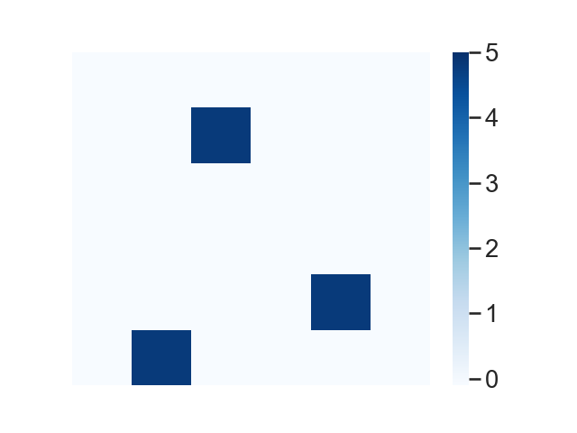
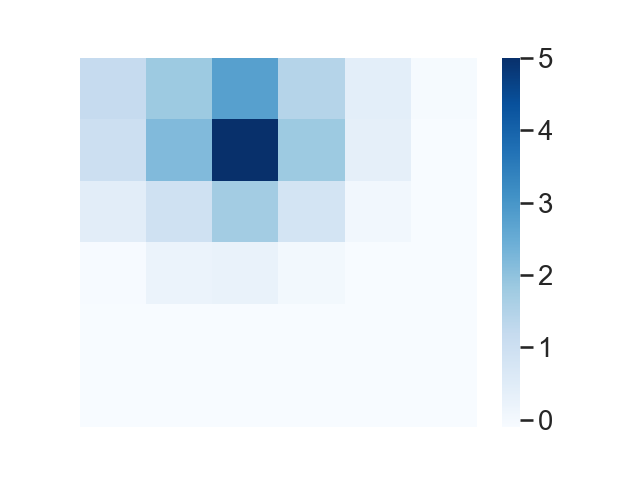
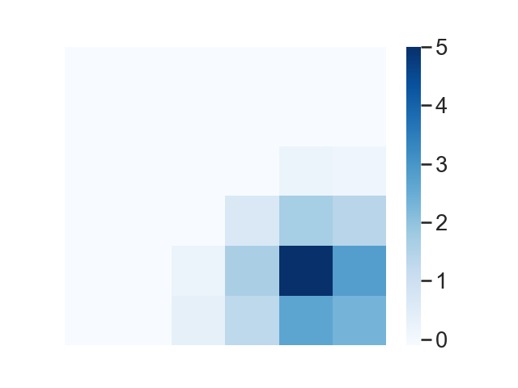
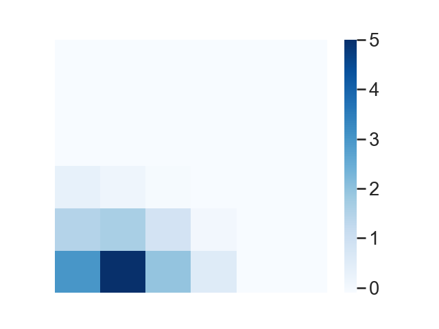
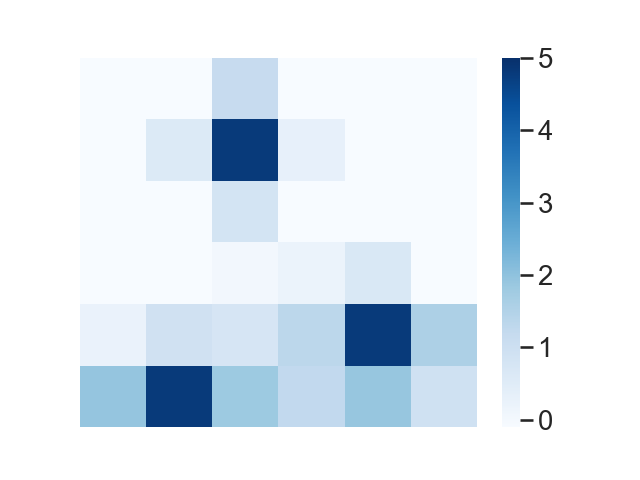
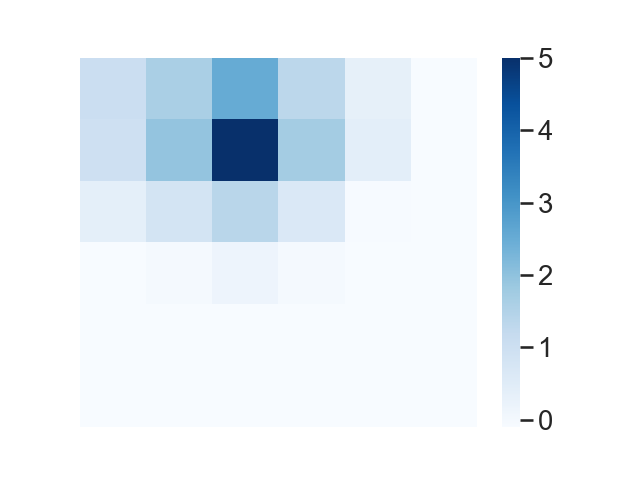
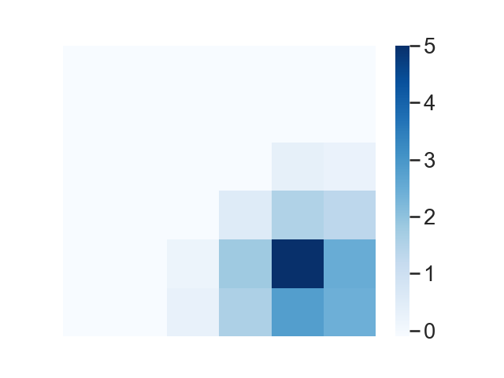
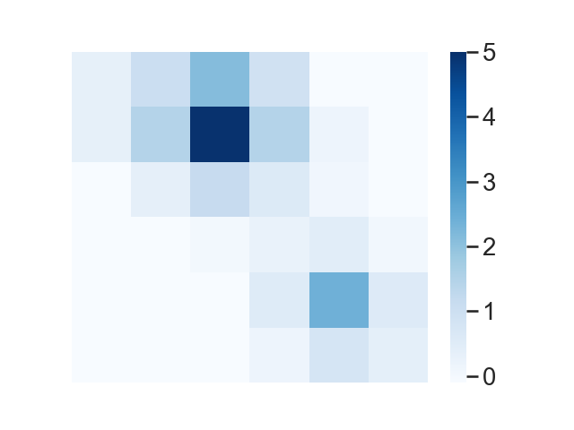
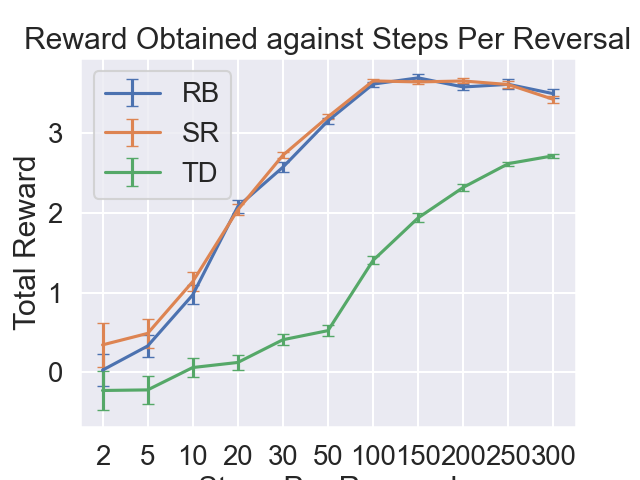
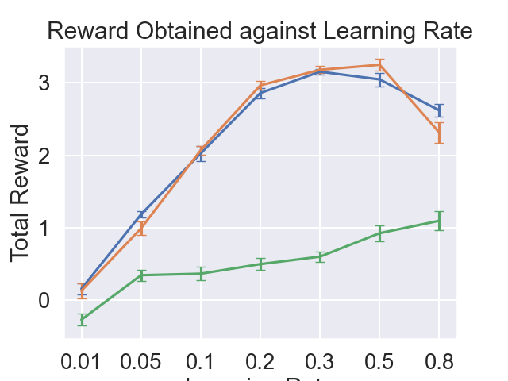

# README

**Run the experiment inside this subfolder.**

Install Python and make sure that the `python` command can be ran from your command line.
Install required python packages with:

```bash
pip install seaborn pandas matplotlib numpy scipy
```

Then run

```bash
python room_task_Simulations.py
```

to produce:

| Column 1                                  | Column 2                                   | Column 3                                   | Column 4                                   | Column 5                                      |
| ----------------------------------------- | ------------------------------------------ | ------------------------------------------ | ------------------------------------------ | --------------------------------------------- |
|            |                    |                    |                    |                                               |
|                |                |                |                |                |
|  |  |  |  |  |

| Column 1                                        | Column 2                                       | Column 3                                 |
| ----------------------------------------------- | ---------------------------------------------- | ---------------------------------------- |
|  |  |  |

## Further information

The file `envs.py` contains the environment classes for the various Simulations and the `learners.py` file contains the classes for the reward basis, temporal difference, and successor representation agent.
