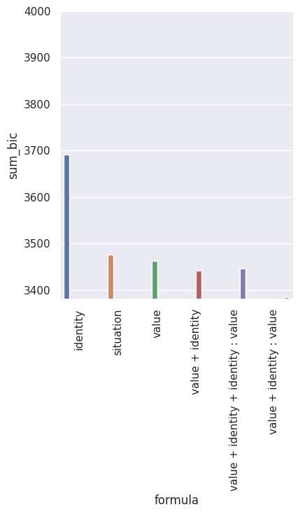
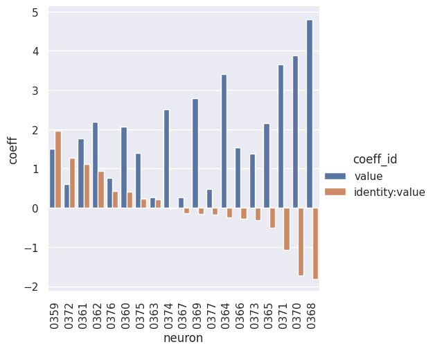
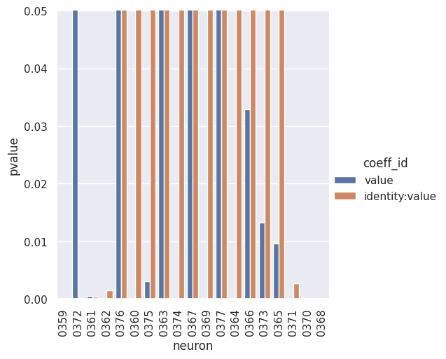
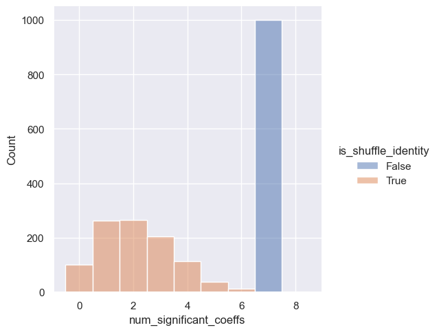
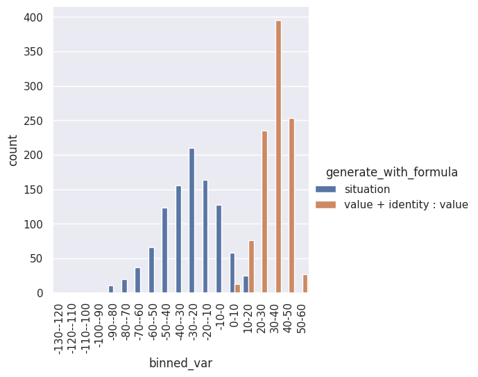

**Run the following command from root directory of the repo.**

# base

```bash
rm -r $RESULTS_DIR/neurons_analysis/ ; \
python main.py -c neurons_analysis/base && \
python analysis_v1.py \
-t "base-bic-all_neuron" \
--p "sns.set_theme()" \
-l $RESULTS_DIR/neurons_analysis/ \
-m "df['bic'].iloc[-1]" \
-f "./Simulations/neurons_analysis/base.yaml" \
-v \
"import Simulations.neurons_analysis.utils as eu" \
"df=eu.proc_df(df, 'bic')" \
"df=au.reduce(df, ['formula'], lambda df: {'sum_bic': df['bic'].sum()})" \
"g=sns.catplot(data=df, kind='bar', y='sum_bic', x='formula')" \
"g.set(ylim=(3380, 3480))" \
"g.set_xticklabels(rotation=90)"
```



# base-formula

```bash
rm -r $RESULTS_DIR/neurons_analysis/ ; \
python main.py -c neurons_analysis/base-formula && \
python analysis_v1.py \
-t "base-formula-coeff" \
--p "sns.set_theme()" \
-l $RESULTS_DIR/neurons_analysis/ \
-m "df['coeff'].iloc[-1]" "df['pvalue'].iloc[-1]" \
-f "./Simulations/neurons_analysis/base-formula.yaml" \
-v \
"import Simulations.neurons_analysis.utils as eu" \
"df=eu.proc_df(df, ['coeff', 'pvalue'])" \
"df=eu.sort_by_id_coeff(df)" \
"g=sns.catplot(data=df, kind='bar', y='coeff', x='neuron', hue='coeff_id')" \
"g.set_xticklabels(rotation=90)" && \
python analysis_v1.py \
-t "base-formula-pvalue" \
--p "sns.set_theme()" \
-l $RESULTS_DIR/neurons_analysis/ \
-m "df['coeff'].iloc[-1]" "df['pvalue'].iloc[-1]" \
-f "./Simulations/neurons_analysis/base-formula.yaml" \
-v \
"import Simulations.neurons_analysis.utils as eu" \
"df=eu.proc_df(df, ['coeff', 'pvalue'])" \
"df=eu.sort_by_id_coeff(df)" \
"g=sns.catplot(data=df, kind='bar', y='pvalue', x='neuron', hue='coeff_id')" \
"g.set(ylim=(0, 0.05))" \
"g.set_xticklabels(rotation=90)"
```





# base-num-significant-coeffs

```bash
rm -r $RESULTS_DIR/neurons_analysis/ ; \
python main.py -c neurons_analysis/base-num-significant-coeffs && \
python analysis_v1.py \
-t "base-num-significant-coeffs" \
--p "sns.set_theme()" \
-l $RESULTS_DIR/neurons_analysis/ \
-m "df['num_significant_coeffs'].iloc[-1]" \
-f "./Simulations/neurons_analysis/base-num-significant-coeffs.yaml" \
-v \
"import Simulations.neurons_analysis.utils as eu" \
"df=eu.proc_df(df, ['num_significant_coeffs'])" \
"bin_edges=np.arange(start=df['num_significant_coeffs'].min() - 0.5, stop=df['num_significant_coeffs'].max() + 1.5, step=1)" \
"sns.displot(data=df, x='num_significant_coeffs', hue='is_shuffle_identity', kind='hist', bins=bin_edges)"
```



# base-two-regressor

```bash
rm -r $RESULTS_DIR/neurons_analysis/ ; \
python main.py -c neurons_analysis/base-two-regressor && \
python analysis_v1.py \
-t "base-two-regressor" \
--p "sns.set_theme()" \
-l $RESULTS_DIR/neurons_analysis/ \
-m "df['coeff_banana'].iloc[-1]" "df['coeff_juice'].iloc[-1]" \
-f "./Simulations/neurons_analysis/base-two-regressor.yaml" \
-v \
"import Simulations.neurons_analysis.utils as eu" \
"df=eu.proc_df(df, ['coeff_banana', 'coeff_juice'])" \
"g=sns.relplot(data=df, kind='scatter', y='coeff_banana', x='coeff_juice')" \
"ax = plt.gca()" \
"ax.set_aspect('equal', adjustable='box')"
```


<!-- # base-two-regressor-compare_coeff

```bash
rm -r $RESULTS_DIR/neurons_analysis/ ; \
python main.py -c neurons_analysis/base-two-regressor-compare_coeff && \
python analysis_v1.py \
-t "base-two-regressor-compare_coeff" \
--p "sns.set_theme()" \
-l $RESULTS_DIR/neurons_analysis/ \
-m "df['coeff_value'].iloc[-1]" "df['coeff_identity_value'].iloc[-1]" \
-f "./Simulations/neurons_analysis/base-two-regressor-compare_coeff.yaml" \
-v \
"import Simulations.neurons_analysis.utils as eu" \
"df=eu.proc_df(df, ['coeff_value', 'coeff_identity_value'])" \
"g=sns.relplot(data=df, kind='scatter', y='coeff_value', x='coeff_identity_value', style='compare_coeff')"
```

 -->

# base-neuron-response

```bash
rm -r $RESULTS_DIR/neurons_analysis/ ; \
python main.py -c neurons_analysis/base-neuron-response && \
python analysis_v1.py \
-t "base-neuron-response" \
--p "sns.set_theme()" \
-l $RESULTS_DIR/neurons_analysis/ \
-m "df['biggest_banana_relative_firing_rate_mean'].iloc[-1]" "df['biggest_juice_relative_firing_rate_mean'].iloc[-1]" "df['biggest_banana_relative_firing_rate_sem_half'].iloc[-1]" "df['biggest_juice_relative_firing_rate_sem_half'].iloc[-1]" \
-f "./Simulations/neurons_analysis/base-neuron-response.yaml" \
-v \
"import Simulations.neurons_analysis.utils as eu" \
"df=eu.proc_df(df, ['biggest_banana_relative_firing_rate_mean', 'biggest_juice_relative_firing_rate_mean', 'biggest_banana_relative_firing_rate_sem_half', 'biggest_juice_relative_firing_rate_sem_half'])" \
"eu.plot_neuron_response(df)"
```


# base-neuron-response-correlation

```bash
rm -r $RESULTS_DIR/neurons_analysis/ ; \
python main.py -c neurons_analysis/base-neuron-response-correlation && \
python analysis_v1.py \
-t "base-neuron-response-correlation" \
--p "sns.set_theme()" \
-l $RESULTS_DIR/neurons_analysis/ \
-m "df['corr'].iloc[-1]" \
-f "./Simulations/neurons_analysis/base-neuron-response-correlation.yaml" \
-v \
"import Simulations.neurons_analysis.utils as eu" \
"df=eu.proc_df(df, ['corr'])" \
"sns.displot(data=df, x='corr', hue='is_shuffle_situation', kind='hist')"
```


# base-data-model

```bash
rm -r $RESULTS_DIR/neurons_analysis/ ; \
python main.py -c neurons_analysis/base-data-model && \
python analysis_v1.py \
-t "base-data-model" \
--p "sns.set_theme()" \
-l $RESULTS_DIR/neurons_analysis/ \
-m "df['epoch_history'].iloc[0]" "df['V_history'].iloc[0]" \
-f "./Simulations/neurons_analysis/base-data-model.yaml" \
-v \
"import Simulations.neurons_analysis.utils as eu" \
"eu.plot_data_model(df)"
```


# model-recovery

```bash
rm -r $RESULTS_DIR/neurons_analysis/ ; \
python main.py -c neurons_analysis/base-model-recovery && \
python analysis_v1.py \
-t "base-model-recovery" \
--p "sns.set_theme()" \
-l $RESULTS_DIR/neurons_analysis/ \
-m "df['bic'].iloc[-1]" \
-f "./Simulations/neurons_analysis/base-model-recovery.yaml" \
-v \
"import Simulations.neurons_analysis.utils as eu" \
"df=eu.proc_df(df, 'bic')" \
"df=au.reduce(df, ['fit_generated_data_with_formula', 'generate_with_formula', 'seed'], lambda df: {'sum_bic': df['bic'].sum()})" \
"g=sns.catplot(data=df, kind='bar', y='sum_bic', x='generate_with_formula', hue='fit_generated_data_with_formula')"
```



# base-formula-block

```bash
rm -r $RESULTS_DIR/neurons_analysis/ ; \
python main.py -c neurons_analysis/base-formula-block && \
python analysis_v1.py \
-t "base-formula-block-coeff" \
--p "sns.set_theme()" \
-l $RESULTS_DIR/neurons_analysis/ \
-m "df['coeff'].iloc[-1]" "df['pvalue'].iloc[-1]" \
-f "./Simulations/neurons_analysis/base-formula-block.yaml" \
-v \
"import Simulations.neurons_analysis.utils as eu" \
"df=eu.proc_df(df, ['coeff', 'pvalue'])" \
"df=eu.sort_by_id_coeff(df, filter_df_fn=lambda df: df[df['get_df_kwargs: trial_block_idxes'] == 0])" \
"g=sns.catplot(data=df, kind='bar', y='coeff', x='neuron', hue='get_df_kwargs: trial_block_idxes')" \
"g.set_xticklabels(rotation=90)"
```


