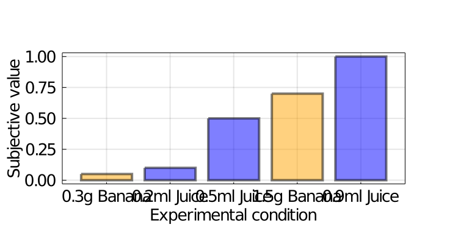
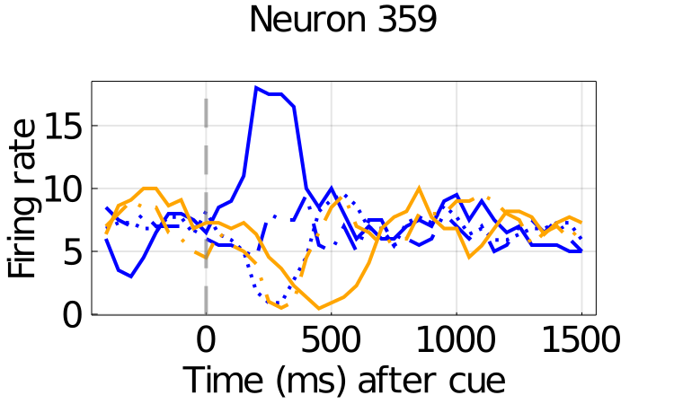
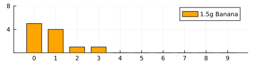
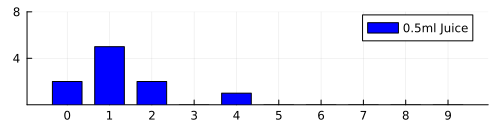
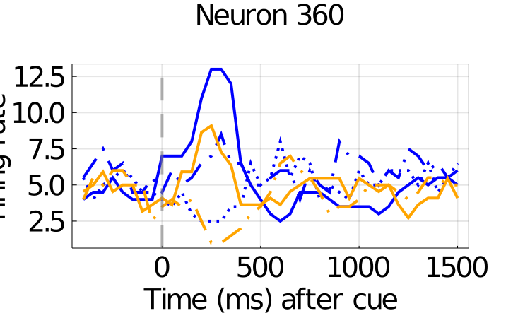

# README

**Run the experiment inside this subfolder.**

Install [Julia](https://julialang.org) and make sure that the `julia` command can be ran from your command line.

Install packages used in the scripts, they are all quite standard, and can be installed with the `Pkg.add` command.
To do that, type `julia` in your command line (you should be inside julia now with your terminal starting with `julia>`) and then run:

```julia
using Pkg
Pkg.add(["MAT", "Plots", "GLM", "DataFrames", "Distributions", "StatsBase", "HypothesisTests", "StatsPlots", "Statistics", "NPZ", "JLD2"])
```

Exit the julia terminal with `Ctrl+D`, then you are good to run in your terminal:

```bash
julia plots.jl
```

to produce:














