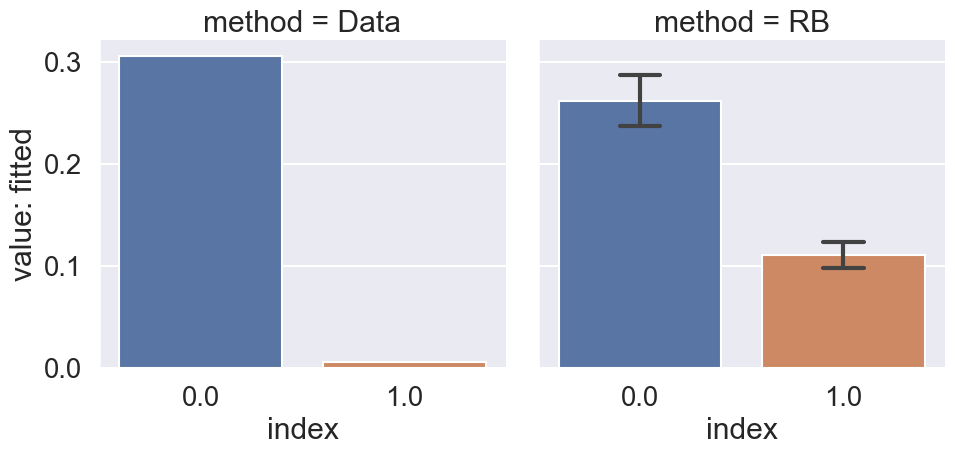
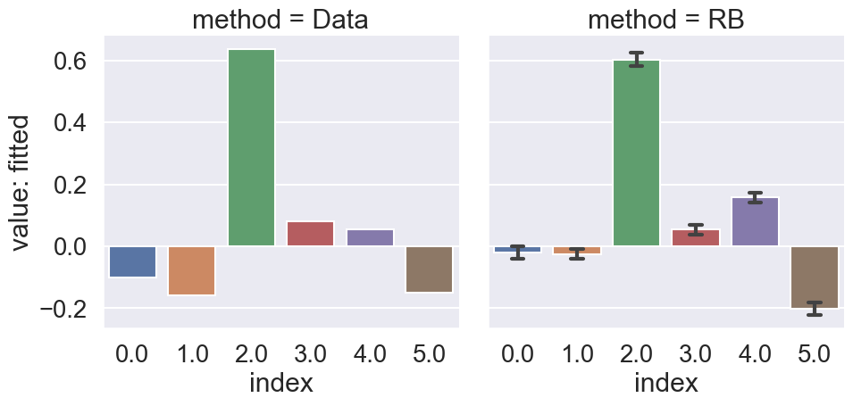

-   [panel_b](#panel_b)
-   [panel_c](#panel_c)
-   [panel_bc](#panel_bc)

Data extrained from [here](https://drive.google.com/drive/folders/1J4yQ3XjXebkNY2GNYrFttIfAT5ODuVJb?usp=sharing) with [this software](https://apps.automeris.io/wpd/).

# panel_b

```bash
python main.py -c dopamine_release/panel_b
```

```bash
python analysis_v1.py \
-t "panel_b" \
-l $RESULTS_DIR/dopamine_release/ \
-m "eval(df['value-along-index'].iloc[-1])" \
-f "./experiments/dopamine_release/panel_b.yaml" \
-v \
"import experiments.dopamine_release.utils as eu" \
"eu.panel_b_fit_data_and_plot(df)"
```



# panel_c

```bash
python main.py -c dopamine_release/panel_c
```

```bash
python analysis_v1.py \
-t "panel_c" \
-l $RESULTS_DIR/dopamine_release/ \
-m "eval(df['value-along-index'].iloc[-1])" \
-f "./experiments/dopamine_release/panel_c.yaml" \
-v \
"import experiments.dopamine_release.utils as eu" \
"eu.panel_c_fit_data_and_plot(df)"
```



# panel_bc

Try to use the same set of parameters for fitting both panels.

```bash
python main.py -c dopamine_release/panel_bc
```

```bash
python analysis_v1.py \
-t "panel_bc" \
-l $RESULTS_DIR/dopamine_release/ \
-m "eval(df['value-along-index'].iloc[-1])" \
-f "./experiments/dopamine_release/panel_bc.yaml" \
-v \
"import experiments.dopamine_release.utils as eu" \
"eu.panel_bc_fit_data_and_plot(df)"
```


