# README

Install [Julia](https://julialang.org) and make sure that the `julia` command can be ran from your command line.

Install packages used in the scripts, they are all quite standard and can be installed with the `Pkg.add` command.
To do that, type `julia` in your command line (you should be inside julia now with your terminal starting with ```julia>```) and then run:

```julia
using Pkg
Pkg.add(["MAT", "Plots", "GLM", "DataFrames", "Distributions", "StatsBase", "HypothesisTests", "StatsPlots", "Statistics", "NPZ", "Plots.PlotMeasures"])
```

Exit the julia terminal with `Ctrl+D`, then you are good to run in your terminal:
```bash
julia plots.jl
```
to produce:

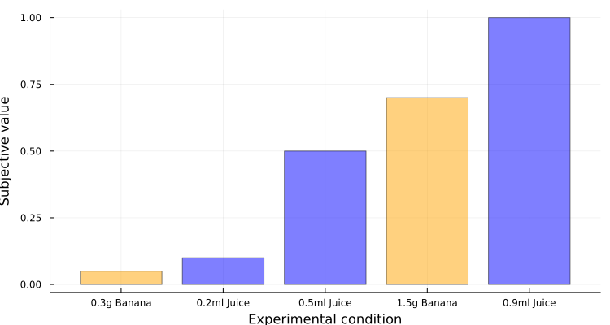

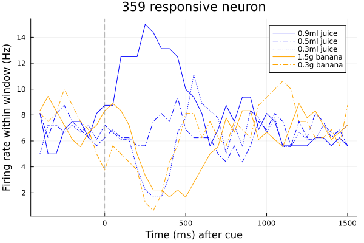

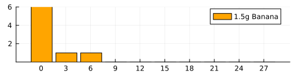

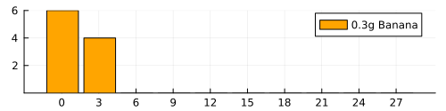

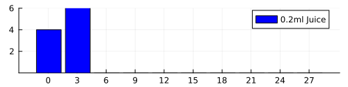

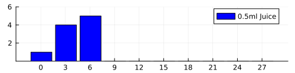

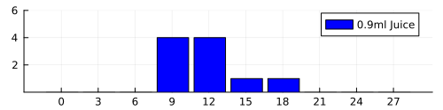

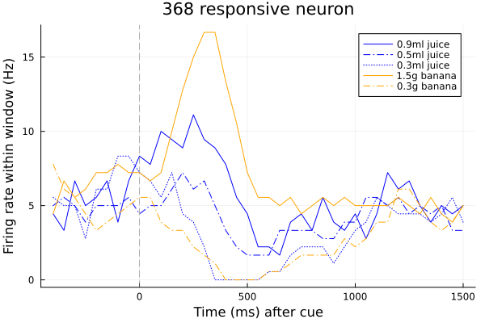

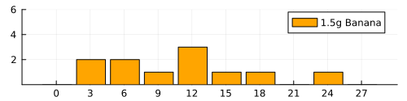

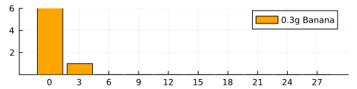

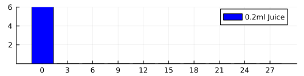

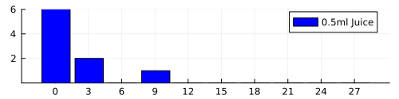

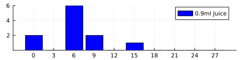

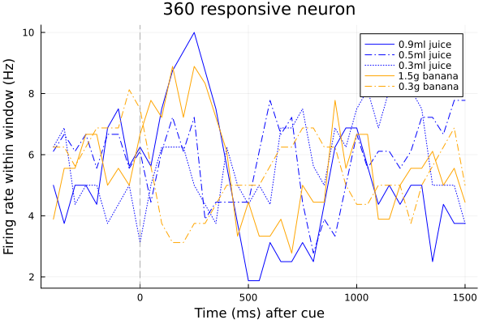

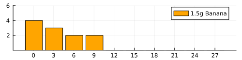

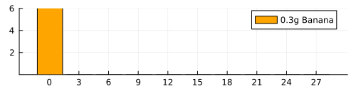

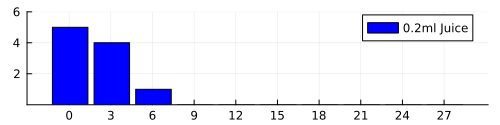

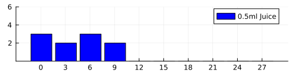

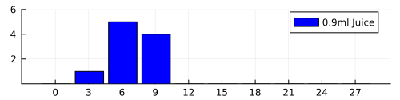
## Cleaned data

Data analysed in the manuscript are available in the directory CleanData. These data were originally reported in: Lak, A., Stauffer, W. R., & Schultz, W. (2014). Dopamine prediction error responses integrate subjective value from different reward dimensions. Proceedings of the National Academy of Sciences, 111(6), 2343-2348. Each file in that directory contains data recorded from a single dopamine neuron (one neuron at the time was recorded in the experiment).

To use the cleaned data in python:

```python
from get_clean_data import get_clean_data

spiketimes_list, stim_onsets_list, situations_list = get_clean_data(path="CleanData/w065-0359.jld2")

print()
print(f"len(spiketimes_list) = {len(spiketimes_list)}")
print(f"len(stim_onsets_list) = {len(stim_onsets_list)}")
print(f"len(situations_list) = {len(situations_list)}")

print()
print(f"spiketimes_list[0] = {spiketimes_list[0]}")
print(f"len(spiketimes_list[0]) = {len(spiketimes_list[0])}")
print(f"stim_onsets_list[0] = {stim_onsets_list[0]}")
print(f"situations_list[0] = {situations_list[0]}")

print()
print(f"spiketimes_list[1] = {spiketimes_list[1]}")
print(f"len(spiketimes_list[1]) = {len(spiketimes_list[1])}")
print(f"stim_onsets_list[1] = {stim_onsets_list[1]}")
print(f"situations_list[1] = {situations_list[1]}")
```

You should get

```bash
len(spiketimes_list) = 63
len(stim_onsets_list) = 63
len(situations_list) = 63

spiketimes_list[0] = [127.0, 271.0, 470.0, 606.0, 696.0, 754.0, 934.0, 1108.0, 1213.0, 1252.0, 1267.0, 1290.0, 1494.0, 1555.0, 1746.0, 2047.0, 2157.0, 2276.0, 2323.0, 2557.0, 2656.0, 2728.0, 2913.0, 3002.0, 3049.0, 3146.0, 3322.0, 3556.0, 3776.0, 3953.0, 4046.0, 4249.0, 4328.0, 4371.0, 4460.0, 4664.0, 4834.0, 5009.0, 5507.0, 5666.0, 5763.0, 5823.0, 5899.0, 6151.0, 6294.0, 6417.0, 6532.0, 6686.0, 6838.0, 6872.0, 6952.0, 7128.0, 7470.0, 7522.0, 7572.0, 7966.0, 8062.0, 8444.0, 8522.0, 8626.0, 8732.0, 8916.0, 9001.0, 9127.0, 9248.0, 9320.0, 9524.0, 9641.0, 9717.0, 9748.0]
len(spiketimes_list[0]) = 70
stim_onsets_list[0] = 2194
situations_list[0] = 3

spiketimes_list[1] = [246.0, 345.0, 442.0, 603.0, 692.0, 797.0, 938.0, 989.0, 999.0, 1019.0, 1062.0, 1297.0, 1403.0, 1597.0, 1862.0, 1966.0, 2018.0, 2508.0, 2619.0, 2695.0, 2953.0, 2979.0, 3006.0, 3266.0, 3559.0, 3804.0, 3900.0, 3970.0, 4315.0, 4465.0, 4509.0, 4593.0, 4837.0, 4941.0, 4966.0, 5079.0, 5184.0, 5288.0, 5519.0, 5687.0, 5855.0, 5975.0, 6184.0, 6479.0, 7471.0, 7542.0, 7755.0, 7979.0, 8117.0, 8119.0, 8319.0, 8658.0, 8846.0, 9116.0, 9191.0]
len(spiketimes_list[1]) = 55
stim_onsets_list[1] = []
situations_list[1] = 25
```

In the above,

- `spiketimes_list`: is a list, each element in it corresponds to one trial and is a list of times the neuron produced spikes on that trial [in ms].
- `stim_onsets_list`: is a list, each element in it is the time the stimulus was presented on a given trial [in ms], or an empty value if no stimulus was presented.
- `situations_list`: is a list, each element in it describes the trial type: 1 = 1.5g banana, 2 = 0.3g banana, 3 = 0.2ml juice, 4 = 0.5ml juice, 5 = 0.9ml juice, 25 = a trial without a stimulus.