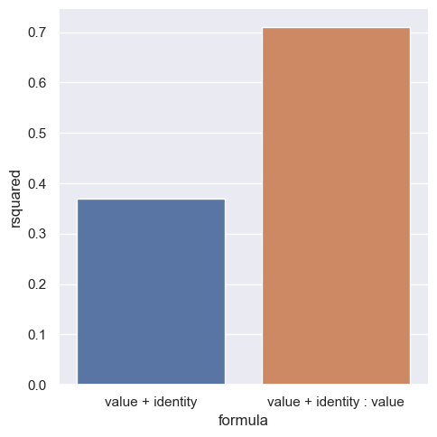

# base

```bash
python main.py -c rb_monkey_new_fit/base -l
```

```bash
python analysis_v1.py \
-t "base" \
-l $RESULTS_DIR/rb_monkey_new_fit/ \
-m "eval(df['value-along-index'].iloc[-1])" \
-f "./experiments/rb_monkey_new_fit/base.yaml" \
-v \
"import experiments.rb_monkey_new_fit.utils as eu" \
"input(df)"
```

