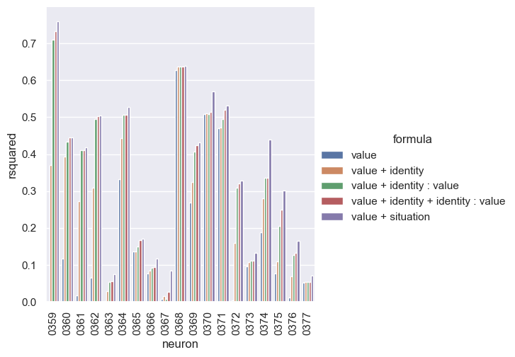

# base

```bash
rm -r $RESULTS_DIR/rb_monkey_new_fit/ ; \
python main.py -c rb_monkey_new_fit/base
```

```bash
python analysis_v1.py \
-t "base-rsquared-per_neuron" \
--p "sns.set_theme()" \
-l $RESULTS_DIR/rb_monkey_new_fit/ \
-m "df['rsquared'].iloc[-1]" \
-f "./experiments/rb_monkey_new_fit/base.yaml" \
-v \
"import experiments.rb_monkey_new_fit.utils as eu" \
"df=eu.proc_df(df, 'rsquared')" \
"g=sns.catplot(data=df, kind='bar', y='rsquared', x='neuron', hue='formula')" \
"g.set_xticklabels(rotation=90)"
```

