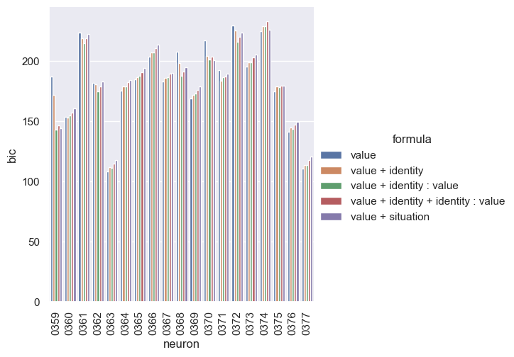

# base

```bash
rm -r $RESULTS_DIR/rb_monkey_new_fit/ ; \
python main.py -c rb_monkey_new_fit/base && \
python analysis_v1.py \
-t "base-rsquared-per_neuron" \
--p "sns.set_theme()" \
-l $RESULTS_DIR/rb_monkey_new_fit/ \
-m "df['rsquared'].iloc[-1]" \
-f "./experiments/rb_monkey_new_fit/base.yaml" \
-v \
"import experiments.rb_monkey_new_fit.utils as eu" \
"eu.plot(df,y='rsquared',x='neuron')" && \
python analysis_v1.py \
-t "base-bic-per_neuron" \
--p "sns.set_theme()" \
-l $RESULTS_DIR/rb_monkey_new_fit/ \
-m "df['bic'].iloc[-1]" \
-f "./experiments/rb_monkey_new_fit/base.yaml" \
-v \
"import experiments.rb_monkey_new_fit.utils as eu" \
"eu.plot(df,y='bic',x='neuron')" && \
python analysis_v1.py \
-t "base-rsquared-all_neuron" \
--p "sns.set_theme()" \
-l $RESULTS_DIR/rb_monkey_new_fit/ \
-m "df['rsquared'].iloc[-1]" \
-f "./experiments/rb_monkey_new_fit/base.yaml" \
-v \
"import experiments.rb_monkey_new_fit.utils as eu" \
"eu.plot(df,y='rsquared',x='formula')" && \
python analysis_v1.py \
-t "base-bic-all_neuron" \
--p "sns.set_theme()" \
-l $RESULTS_DIR/rb_monkey_new_fit/ \
-m "df['bic'].iloc[-1]" \
-f "./experiments/rb_monkey_new_fit/base.yaml" \
-v \
"import experiments.rb_monkey_new_fit.utils as eu" \
"eu.plot(df,y='bic',x='formula')"
```





