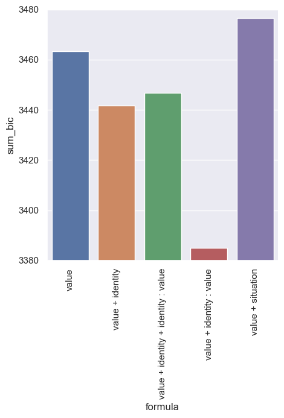
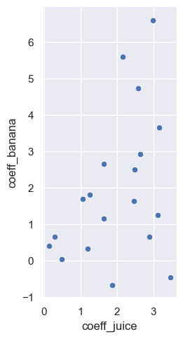

# base

```bash
rm -r $RESULTS_DIR/rb_monkey_new_fit/ ; \
python main.py -c rb_monkey_new_fit/base
```

```bash
python analysis_v1.py \
-t "base-bic-all_neuron" \
--p "sns.set_theme()" \
-l $RESULTS_DIR/rb_monkey_new_fit/ \
-m "df['bic'].iloc[-1]" \
-f "./experiments/rb_monkey_new_fit/base.yaml" \
-v \
"import experiments.rb_monkey_new_fit.utils as eu" \
"df=eu.proc_df(df, 'bic')" \
"df=au.reduce(df, ['formula'], lambda df: {'sum_bic': df['bic'].sum()})" \
"g=sns.catplot(data=df, kind='bar', y='sum_bic', x='formula')" \
"g.set(ylim=(3380, 3480))" \
"g.set_xticklabels(rotation=90)"
```



# base-formula

```bash
rm -r $RESULTS_DIR/rb_monkey_new_fit/ ; \
python main.py -c rb_monkey_new_fit/base-formula
```

```bash
python analysis_v1.py \
-t "base-formula-coeff" \
--p "sns.set_theme()" \
-l $RESULTS_DIR/rb_monkey_new_fit/ \
-m "df['coeff'].iloc[-1]" "df['pvalue'].iloc[-1]" \
-f "./experiments/rb_monkey_new_fit/base-formula.yaml" \
-v \
"import experiments.rb_monkey_new_fit.utils as eu" \
"df=eu.proc_df(df, ['coeff', 'pvalue'])" \
"df=eu.sort_by_id_coeff(df)" \
"g=sns.catplot(data=df, kind='bar', y='coeff', x='neuron', hue='coeff_id')" \
"g.set_xticklabels(rotation=90)"
```


```bash
python analysis_v1.py \
-t "base-formula-pvalue" \
--p "sns.set_theme()" \
-l $RESULTS_DIR/rb_monkey_new_fit/ \
-m "df['coeff'].iloc[-1]" "df['pvalue'].iloc[-1]" \
-f "./experiments/rb_monkey_new_fit/base-formula.yaml" \
-v \
"import experiments.rb_monkey_new_fit.utils as eu" \
"df=eu.proc_df(df, ['coeff', 'pvalue'])" \
"df=eu.sort_by_id_coeff(df)" \
"g=sns.catplot(data=df, kind='bar', y='pvalue', x='neuron', hue='coeff_id')" \
"g.set(ylim=(0, 0.05))" \
"g.set_xticklabels(rotation=90)"
```


```bash
rm -r $RESULTS_DIR/rb_monkey_new_fit/ ; \
python main.py -c rb_monkey_new_fit/base-two-regressor
```

```bash
python analysis_v1.py \
-t "base-two-regressor" \
--p "sns.set_theme()" \
-l $RESULTS_DIR/rb_monkey_new_fit/ \
-m "df['coeff'].iloc[-1]" "df['pvalue'].iloc[-1]" \
-f "./experiments/rb_monkey_new_fit/base-two-regressor.yaml" \
-v \
"import experiments.rb_monkey_new_fit.utils as eu" \
"df=eu.proc_df(df, ['coeff', 'pvalue'])" \
"df=eu.sort_by_id_coeff(df)" \
"g=sns.catplot(data=df, kind='bar', y='coeff', x='neuron', hue='coeff_id')" \
"g.set_xticklabels(rotation=90)"
```

